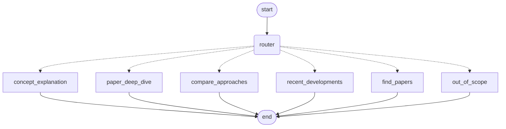

# Architecture

This document explains how the AI Research Navigator is put together: the two
pipelines (offline ingestion, online query), the data model that connects
them, and the reasoning behind each major design choice. Individual decisions
have their own short ADRs in [docs/adr/](docs/adr/); this document is the map
that ties them together.

## 1. System diagram

```
                         OFFLINE INGESTION (M1)
┌──────────┐    ┌───────────┐    ┌───────────┐    ┌─────────────────────┐
│ corpus/  │───▶│ parse/    │───▶│ chunk/    │───▶│ ingest/              │
│ 50 docs  │    │ PDF+MD    │    │ content-  │    │ FastEmbed (dense+    │
│ +manifest│    │ -> IR     │    │ type-aware│    │ sparse) -> Qdrant    │
│          │    │ (cached   │    │ chunking  │    │ hybrid collection    │
│          │    │ to disk)  │    │ (cached)  │    │ (idempotent upsert)  │
└──────────┘    └───────────┘    └───────────┘    └──────────┬───────────┘
                                                              │
                                                              ▼
                                                        ┌───────────┐
                                                        │  Qdrant   │
                                                        │ (Docker)  │
                                                        └─────┬─────┘
                                                              │
                         ONLINE QUERY (M2 + M3)               │
┌──────────┐    ┌──────────────┐    ┌──────────────┐         │
│  query   │───▶│ agents/      │───▶│ retrieve/    │◀────────┘
│          │    │ Router ->    │    │ query        │
│          │    │ 6 route      │    │ understanding│
│          │    │ nodes (M3)   │    │ + hybrid RRF │
│          │    └──────┬───────┘    │ fusion +     │
│          │           │            │ cosine       │
│          │           ▼            │ refusal gate │
│          │    ┌──────────────┐    └──────┬───────┘
│          │    │ generate/    │◀──────────┘
│          │    │ cited answer │
│          │    │ or refusal   │
└──────────┘    └──────────────┘

                         EVALUATION (M4)
┌────────────┐   ┌────────────┐   ┌─────────────────────────────┐
│ golden_set │──▶│ eval/runner│──▶│ eval/report.{json,md}        │
│ .json (40) │   │ (drives    │   │ P/R@k, routing acc, refusal, │
│            │   │  agent+gen)│   │ LLM-judge faithfulness, cost │
└────────────┘   └────────────┘   └───────────────────────────────┘
```

The agent graph (M3), rendered by `make graph` (offline, no network) into
[docs/agent_graph.mmd](docs/agent_graph.mmd):



## 2. Data model

The manifest (`corpus/manifest.json`) is the single source of truth for
document-level metadata (`doc_id`, `content_type`, `title`, `authors`, `year`,
`tags`, `is_foundational`, `source_url`, ...). Everything downstream *extends*
it rather than replacing it:

```
ManifestEntry (document-level, provided)
   └─ Chunk(ManifestEntry)          # chunk/models.py — inherits every manifest
        + section_index/title/kind    field by construction, adds only what's
        + chunk_index, text            derived at chunk time (assignment §1c)
        + token_count, content_hash
        + is_abstract
```

`Chunk.payload()` (`model_dump(mode="json")`) *is* the Qdrant point payload —
there's no separate payload-shaping step to drift out of sync with the model.

**Point identity** (`ingest/ids.py`): `point_id = uuid5(NAMESPACE, chunk_uid)`
where `chunk_uid = f"{doc_id}:{chunk_index}:{content_hash[:16]}"`. Because the
id is a pure function of content, re-ingesting an unchanged corpus recomputes
the same ids and diffs to zero writes; editing one document's text changes
only that chunk's id (new point added, old point's id no longer desired ⇒
deleted). See ADR-0004.

## 3. Pipeline stages and their key decisions

### parse/ (M1a)
PyMuPDF for PDFs (chosen over GROBID — better for references but needs a Java
sidecar service — and over pdfplumber/unstructured/pypdf). Multi-column
layout is handled by a midpoint-split + density check per page; headings are
detected by a hybrid rule (regex for `Abstract`/`References`/numbered
sections, OR font-size ≥1.12× body text + short line + no trailing period).
Markdown (course chapters, blog posts) goes through markdown-it-py's
CommonMark token stream. References sections are tagged but retained (needed
for citation lookup) and excluded only at the *retrieval* boundary
(`ParsedDocument.retrievable_sections`), not deleted.

**Known weakness** (see [docs/OBSERVATIONS.md](docs/OBSERVATIONS.md)): the
font-size heading heuristic also fires on arXiv running headers
(`arXiv:1706.03762v7 [cs.CL] 2 Aug 2023`) and on numeric table/figure rows,
producing garbled `section_title` values on ~27% of arXiv sections. It never
corrupts the retrievable *text* — only the human-readable section label shown
in citations — but it's a real, documented gap, not a hidden one.

### chunk/ (M1b)
Section-bounded greedy packing, per-content-type target/max/overlap token
budgets (arXiv 320/512/64, surveys/blogs 384/512/64, course chapters
320/512/48 — all in `chunk/settings.py`, nothing hardcoded). Abstracts are
emitted as one flagged chunk regardless of size; code blocks are atomic
(never split, never duplicated by overlap); prose overlap is trimmed so a
chunk never exceeds `max_tokens`. Length is measured with the *embedding
model's own* subword tokenizer (`BAAI/bge-small-en-v1.5`) so truncation at
embed time matches what was measured at chunk time.

### ingest/ (M1c–f)
FastEmbed (ONNX, no torch) for both the dense vector (`bge-small-en-v1.5`,
384-dim) and the sparse vector (`Qdrant/bm25`) from one dependency, behind an
`Embedder` protocol so the backend is swappable and tests can fake it. The
Qdrant collection has two named vectors (`dense`, `bm25`) with
`Modifier.IDF` set on the sparse vector at *creation* time (server-side IDF,
not client-side), plus payload indexes on the fields actually filtered on
(`content_type`, `year`, `tags`, `primary_category`, `is_foundational`).
Ingestion is a per-document diff (§2, `uuid5` over `chunk_uid`): embed only
what's being written, delete only what's stale, touch nothing else. See
ADR-0002 (FastEmbed), ADR-0003 (hybrid schema + IDF), ADR-0004
(content-addressed ids).

### retrieve/ (M2)
Query understanding is **deterministic rules**, not an LLM call
(`retrieve/query_understanding.py`): recency cues / explicit years / "last N
years" → `year_gte`; tag vocabulary matched against words/phrases; content-type
trigger phrases; a foundational cue → `is_foundational=True`. The tag/content-type
vocabulary itself is derived from the manifest at load time
(`QueryCatalog.from_manifest_rows`), so swapping the corpus doesn't require
touching this code — filters can only ever reference tags/types that actually
exist in the current corpus. Filters are applied **server-side**, inside each
prefetch branch of Qdrant's Query API
(`prefetch=[Prefetch(using="dense", filter=...), Prefetch(using="bm25", filter=...)],
query=FusionQuery(fusion=RRF)`) — never as a post-hoc Python filter. See
ADR-0005 (rules, not LLM) and ADR-0006 (RRF fusion + refusal calibration).

**Refusal gate**: RRF-fused scores are rank-based and not on any fixed scale,
so they cannot be thresholded directly. The retriever runs a *separate* dense
cosine probe against the same candidates and refuses when the max cosine is
below `refusal_threshold` (0.35, tuned) — this is the number the assignment's
"low-confidence refusal path" acceptance criterion is checked against.
Filter relaxation is all-or-nothing today (filtered-empty → retry fully
unfiltered): a documented simplification, not a silent behavior (a warning is
logged on every relaxation).

### generate/ (M2)
Citation **dedup** happens at the source level (`generate/sources.py`):
multiple chunks from the same `doc_id` collapse into one numbered `Source`
pointing at the highest-scoring chunk's section. Anti-fabrication is
enforced deterministically, not by trusting the model
(`generate/markers.py::render_citations`): any `[n]` the LLM emits that
doesn't map to a real numbered source is *dropped*, surviving citations are
renumbered contiguously by first appearance, and the sentence they came from
is flagged (not deleted) as uncited. Three independent refusal layers exist —
retrieval's cosine gate, the LLM's own sentinel abstention
(`INSUFFICIENT_CONTEXT`), and an empty-citation guard after marker
validation — so the failure mode for any of them is always "decline
gracefully," never "answer without grounding." See ADR-0009.

The LLM client (`generate/llm.py::OpenAIChatModel`) retries 429/5xx
responses with exponential backoff (`max_retries`/`retry_base_delay` in
`LLMSettings`, both configurable) before failing loud — added after a live
`make eval` run against a free-tier key showed most failures were transient
rate limits, not real errors. A *daily* quota (e.g. Gemini free tier's 20
requests/day) will still exhaust and fail loud once retries are spent; that's
a capacity problem no client-side retry can paper over (see
docs/OBSERVATIONS.md).

### agents/ (M3)
A `LangGraph` `StateGraph`: `START → router → {6 route nodes} → END`, compiled
and validated at build time. The router is **hybrid**: fast deterministic
keyword rules run first in a fixed priority order
(`find_papers > compare_approaches > recent_developments > paper_deep_dive >
concept_explanation`); only a genuinely cue-free query falls through to an LLM
classifier (same `LanguageModel` protocol the generator uses). If the LLM
router is disabled or its reply is unparseable, the default route is
`concept_explanation` — a mis-route there still degrades to M2's retrieval
refusal gate, so the worst case is a graceful decline, never a fabrication.
`find_papers` is answered **without any LLM call** — straight from the
manifest via `CorpusIndex` — because "which papers do you have on X" is a
metadata lookup, and answering it generatively risks inventing titles/authors.
State (`AgentState`) is a `TypedDict(total=False)` of JSON primitives so the
whole run is checkpointable/serializable (tested via a `json.dumps`
round-trip). See ADR-0007 for the full decision record.

### eval/ (M4)
The harness (`eval/runner.py`) is decoupled from concrete infra via ports
(`eval/ports.py`): a `Retrieving`/`Generating`/`Routing` protocol per stage, so
the identical evaluation logic runs against either real Qdrant+LLM
(`eval/factory.py::build_real_builder`) or in-repo fakes
(`build_dry_run_builder`, used by `--dry-run` and CI). Retrieval precision/
recall are computed at the **document level** (not chunk level) against the
golden set's `expected_doc_ids`, because expected-section labels are
best-effort and a document-level metric is more robust to reasonable ranking
variation. Citation faithfulness uses a single LLM judge against an explicit
rubric (grounding + attribution), with defensive JSON parsing and a
`judge_min_score` gate — parse failures count as non-faithful, never silently
skipped. Token/cost accounting degrades from exact (`tiktoken`, optional
extra) to a `len/4` heuristic when `tiktoken` isn't installed, and the report
says which mode it used. See ADR-0008.

The adapters (`eval/adapters.py`) are the *only* place `eval` names the
concrete M2/M3 types, deliberately — see ADR-0011 for a case where that
isolation boundary itself hid a bug for a full session: `AgentResult.answer`
is a plain dict, and reading it with `getattr` silently returned empty
citations on every run until fixed. Citation-faithfulness judging (ADR-0010,
ADR-0011) now runs against a local Ollama model rather than the originally
wired cloud key, which had too small a free-tier quota to sustain the call
volume `make eval` needs.

## 4. Configuration

Every tunable — chunk sizes, the refusal threshold, router cue lists, retry
counts, eval judge thresholds — is a field on a `pydantic-settings` model
nested under the single `Settings` object (`config.py`), overridable via
`RN_<SECTION>__<FIELD>` env vars (double underscore; see `.env.example`).
Nothing is a magic number buried in a function body. This is what lets ADRs
describe *tuned* values (e.g. `refusal_threshold=0.35`) as data, not code.

## 5. Testing strategy

- **Unit**: parsing, chunking (determinism, boundaries, hashing), filter
  inference, citation rendering/dedup, router rules, eval metrics — all
  hermetic, no I/O.
- **Component-integration, hermetic**: ingest/retrieve tests run against
  `QdrantClient(":memory:")` with a fake embedder; agent tests exercise all 6
  routes end-to-end with fake generators/LLMs; CLI tests
  (`tests/test_cli.py`) drive every command through Typer's `CliRunner` with
  the Qdrant/FastEmbed/LLM seams patched, checking argument handling, output
  rendering, and exit codes independent of the modules they wire together.
- **Integration, live** (`make test-integration`, marked `integration`,
  deselected by default): the one test that requires a real running Qdrant.
- Coverage floor: 70% (M5 requirement); current: ~90% (`make test`).

## 6. What's out of scope (by the problem statement)

Corpus acquisition/licensing, auth/billing, production infra hardening,
mobile clients, and fine-tuning embedding/generation models are explicitly
non-goals (§3). Multilingual (Hindi/Tamil) query handling is bonus track B4
and is not implemented.

## 7. Honest limitations

See [docs/OBSERVATIONS.md](docs/OBSERVATIONS.md) for the full list with real
numbers pulled from this corpus (heading-detection false-positive rate,
warning counts by content type, etc.), and [eval/report.md](eval/report.md)
for the evaluation harness's own limitations section.
